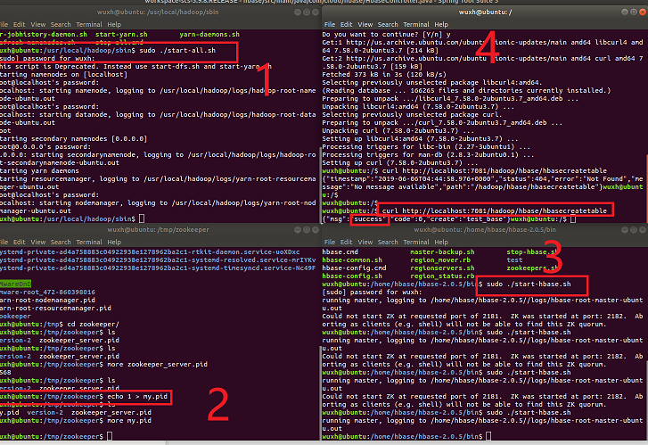

# Hbase_sample

使用java测试hadoop的例子。

包括

测试删除、创建表

测试指定startRowKey和stopRowKey的查询

测试获取所有表名

测试获取指定单元格多个版本的数据

测试根据行键过滤器查询数据

测试根据列名过滤器查询数据

测试查询行键中包含特定字符的数据

测试删除指定的列

测试删除指定的行

测试删除指定的列族

# hbase环境
### 1.我的虚拟机下载
https://github.com/wuxh123/hadoop_text

目前最新版虚拟机没传上去（太大了），等着再追加内容的时候一起传

### 2.可以使用docker
##### docker镜像拉取
docker pull harisekhon/hbase:1.3

# 使用我的虚拟机测试如图

# 其他说明

在windows下连接ubuntu虚拟机，没配置好，按照网上的各种教程配置了也不行。后来也没时间总配这个环境，就在linux下直接搞了。

